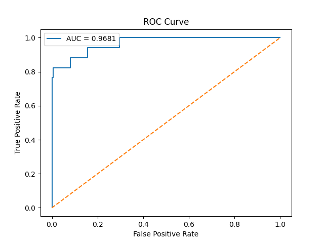
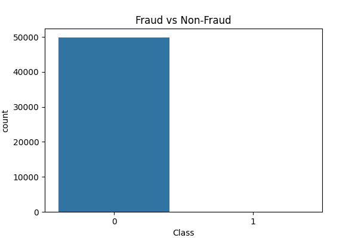
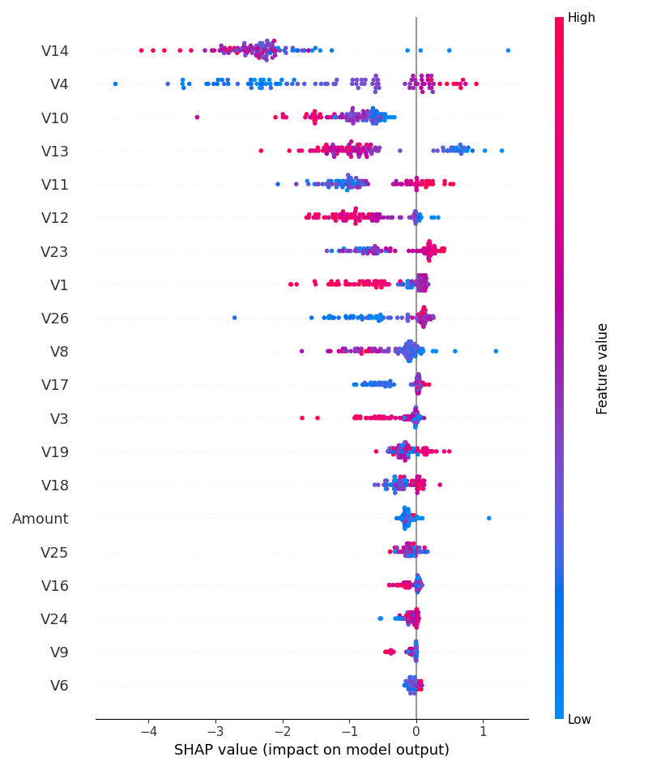

# 🚀 Fraud Intelligence System
## 💳 AI-Powered Real-Time Credit Card Fraud Detection

<p align="center">
  
  
  
  
  
</p>

<p align="center">
  <b>End-to-End ML System | Real-Time Predictions | Explainable AI</b>
</p>

---

## 🌟 Live Demo  
👉 https://fraud-intelligence-system-hggkcwgzfedtxebxsts2nt.streamlit.app/

---

## 🧠 What This Project Does

This is a **production-style machine learning system** that detects fraudulent credit card transactions in real-time using:

- ⚡ XGBoost (high-performance gradient boosting)
- ⚖️ SMOTE (handling extreme class imbalance)
- 🔍 SHAP (model explainability)
- 🌐 Streamlit (interactive UI dashboard)

---

## 🎯 Key Highlights

- ✔ Real-time fraud prediction  
- ✔ Batch fraud detection (CSV upload)  
- ✔ Feature importance visualization (SHAP)  
- ✔ Clean ML pipeline (no data leakage)  
- ✔ Consistent preprocessing (saved scaler)  
- ✔ Deployable & scalable architecture  

---

## 📊 Model Performance

<p align="center">
  
</p>

| Metric | Score |
|------|------|
| 🔥 ROC-AUC | 0.968 |
| 🎯 Accuracy | 99.85% |
| ⚠ Fraud Recall | 70.59% |

---

## 📸 UI Preview

<p align="center">
  
  
</p>

✨ Beautiful dark-themed dashboard with real-time analytics

---

## ⚙️ Architecture

### 🧩 Project Structure

```bash
fraud-intelligence-system/
│
├── dashboard/          # Streamlit UI
│   └── app.py
│
├── src/                # ML pipeline
│   ├── train.py
│   ├── preprocessing.py
│   └── model.py
│
├── models/             # Saved artifacts
│   ├── fraud_model.pkl
│   └── scaler.pkl
│
├── outputs/            # Visualizations
│   ├── roc_curve.png
│   ├── shap_summary.png
│   └── class_distribution.png
│
├── data/               # Dataset
├── requirements.txt
└── README.md
